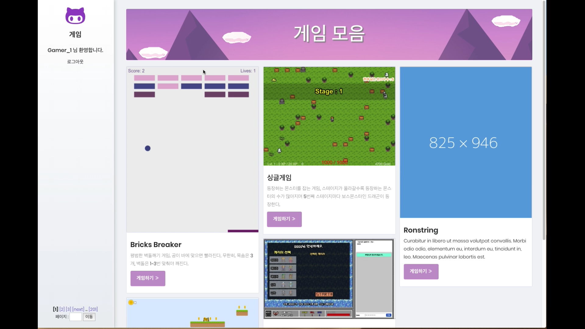
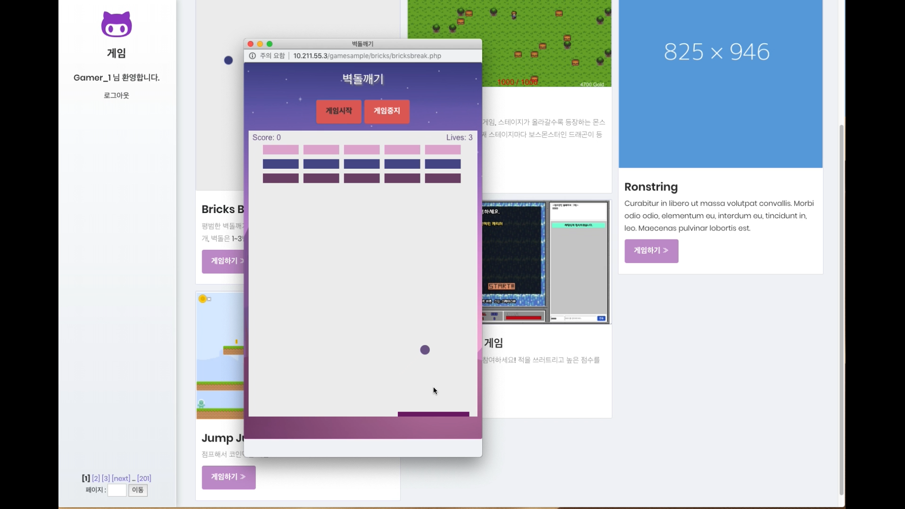
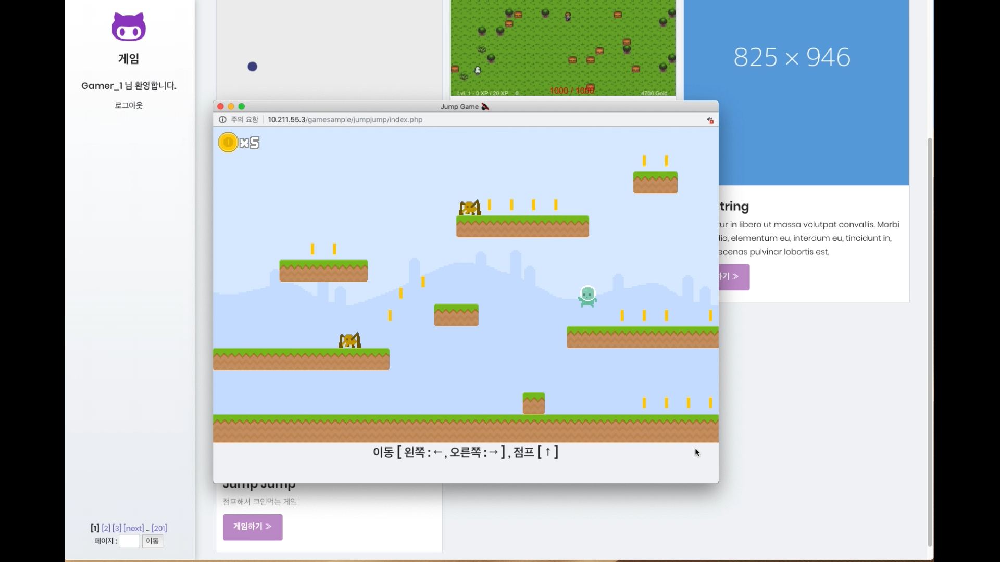
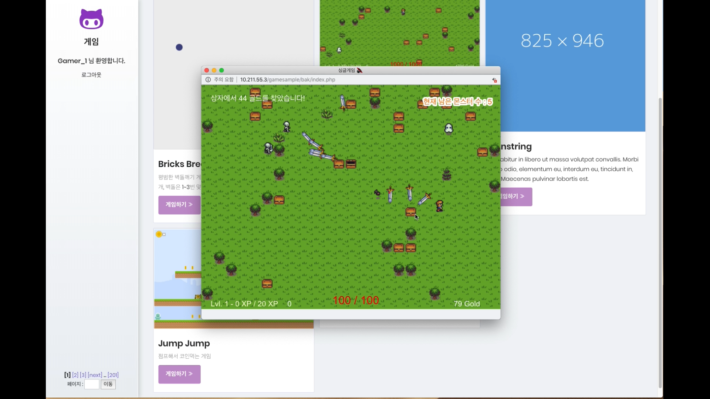
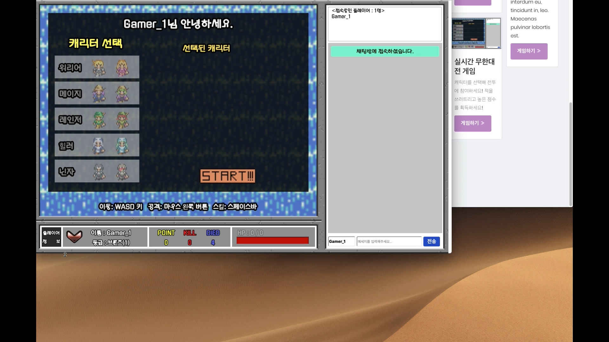
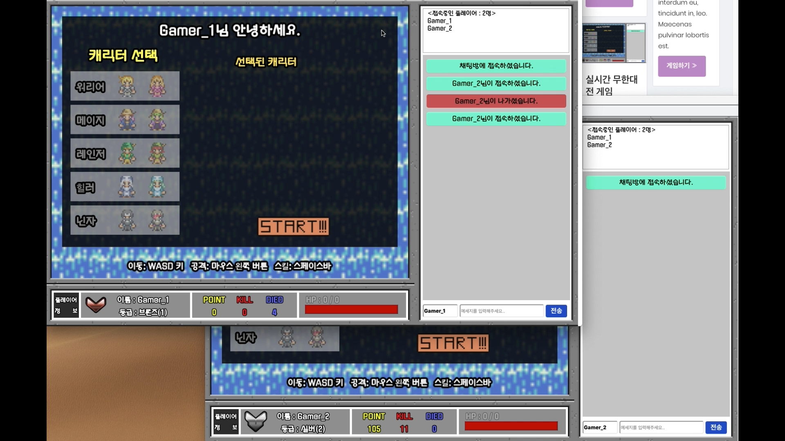
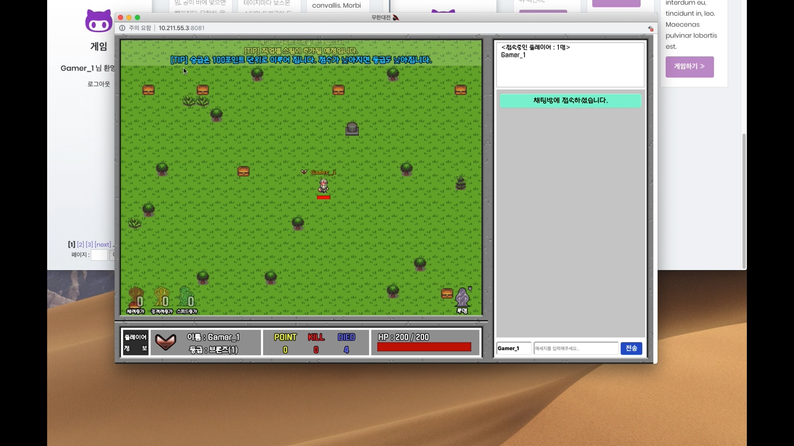
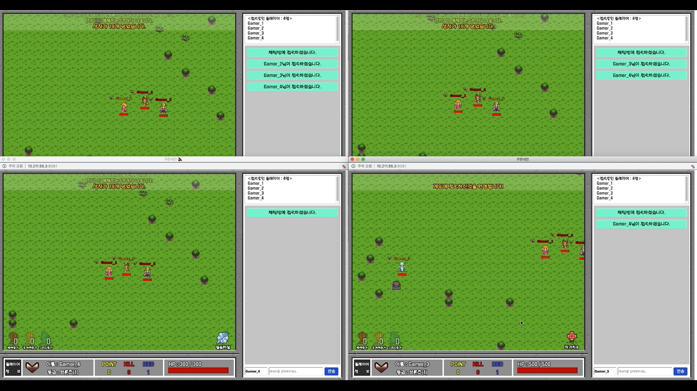
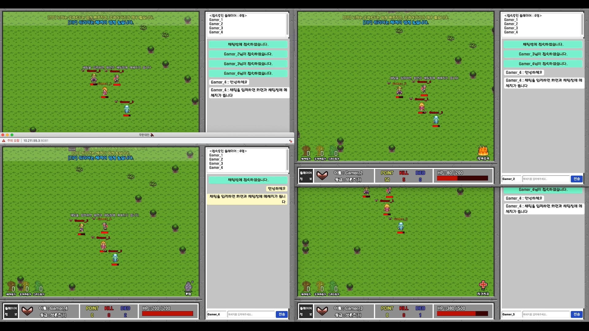
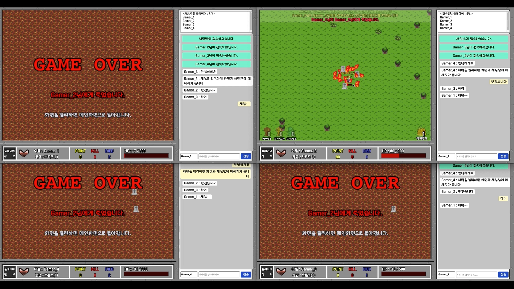

# 게임 모음 사이트
Phaser2 엔진을 이용한 웹게임과 이 게임을 서비스하는 홈페이지를 만들었습니다.
만든 게임은 싱글 게임3개와 멀티플레이 게임 1개입니다.
벽돌깨기 게임과 점프게임은 연습삼아 예제를 따라 만든 게임입니다.
나머지 싱글 게임은 등장하는 몬스터를 잡으면 되는 게임입니다.
또 스테이지가 올라갈수록 더 많은 몬스터가 등장하고 5번째 스테이지마다 보스몬스터인 드래곤이 등장합니다.
멀티플레이 게임은 실시간 무한대전 게임입니다.
총 5개의 클래스(워리어, 메이지, 레인저, 힐러, 닌자)를 선택할 수 있으며, 캐릭터를 선택해서 다른 플레이어를 쓰러뜨리면 되는 게임입니다.
상대방의 등급(브론즈 - 실버 - ... - 마스터 - 신)에 따라 포인트를 획득할 수 있고, 포인트에 따라 등급의 변동이 생깁니다.
게임 진행중에 다른 플레이어와 채팅도 가능합니다.
그리고 죽으면 바로 재시작을해서 캐릭터를 선택후 전투에 다시 참여가 가능합니다.

## 주요기능
<홈페이지 기능>

1. 데이터베이스를 이용해 회원아이디 중복체크, 회원 가입 및 로그인이 가능합니다.
2. 세션기능을 이용해서 새로고침을 해도 로그아웃이 되지 않습니다.
3. 페이징기능을 이용해 게시글 목록을 나눠놨습니다.

<멀티플레이 게임 기능>

1. Phaser 게임 엔진을 이용해 게임을 구현했습니다.
2. 캐릭터의 공격, 이동, 오브젝트와의 상호작용, 포션습득및 효과 적용, 스킬 사용이 가능합니다.
3. Node.js를 이용해 다른 사용자와 상호작용이 가능한 실시간 서버를 구축했습니다.
4. 게임을 진행하며 간단한 채팅이 가능합니다.
5. 데이터베이스를 이용해 플레이한 게임의 정보가 저장됩니다.

## 사용기술
- Javascript, PHP, HTML, CSS
- Linux(CestOS)
- Apache
- Mysql
- Phaser CE v2.11.0
- jQuery, Bootstrap, Node.js(+ Express, Socket.io, body-parser)

### 기타
- 게임 에셋 - 캐릭터 및 기타 게임 이미지 : [https://opengameart.org/](https://opengameart.org/)
- 참고한 게임 : [https://github.com/tlmader/theodoric](https://github.com/tlmader/theodoric)
- 등급 아이콘 : 블리자드 오버워치 랭킹아이콘

## 영상

[ 추가 예정 ]

## 스크린샷 및 상세 설명

### 메인화면

로그인 후 보이는 페이지입니다. 로그인 전에는 보이지 않도록 세션 처리를 했습니다. '게임하기' 버튼을 누르면 선택한 게임을 플레이할 수 있습니다.

### 벽돌깨기 게임

첫 번째 게임인 벽돌깨기 게임입니다. HTML5의 기본적인 Canvas 기능을 이용해서 만든 게임입니다.

### 점프점프 게임

Phaser에서 제공하는 튜토리얼을 따라만든 게임입니다. 연습용으로 제작한 게임으로 몬스터를 피하면서 코인을 먹으면 되는 게임입니다.

### 싱글 게임

이 게임은 [theodoric](http://tlmader.github.io/theodoric/) 게임을 기반으로 만들었습니다. 스테이지를 추가하고, 등장 몬스터를 더 넣는등의 수정을 하였습니다. 5 스테이지마다 보스몬스터가 등장하며, 죽지않고 최대한 많은 스테이지를 깨는 것이 목표인 게임입니다.

### 실시간 무한대전 멀티플레이 게임

이 게임도 [theodoric](http://tlmader.github.io/theodoric/)를 기반으로 만들었습니다. 캐릭터 추가, 클래스 추가, 기술 추가 등등.. 많은 변화를 거쳐서 멀티플레이가 가능하도록 구현했습니다. 채팅 및 게임 진행은 모두 Node.js 기반의 Socket.io로 통신합니다.

게임 시작화면입니다. 플레이하고 싶은 클래스를 선택한 후 START 버튼을 누르면 게임이 시작됩니다. 각 클래스마다 사용할수 있는 기술과 능력치가 다르게 설정되어 있습니다. 또한 로그인한 유저의 정보를 DB에서 가져와서 등급과 점수, 죽인수, 죽은 수를 표시해줍니다.

오른쪽 채팅부분에 다른 유저가 접속하면 누가 접속했는지 나타납니다. 

게임을 시작했을떄의 화면입니다. 화면 상단에는 지속적으로 TIP 메세지와, 시스템 메세지가 표시됩니다.
맵에는 보물상자가 등장하며 보물상자를 깨면 포션(체력증가, 공격력증가, 이동속도증가, 체력회복)을 얻을 수 있습니다. 상자는 특정 시간마다 랜덤하게 등장합니다.
화면의 하단 부분에는 포션섭취시 버프의 시간을 표시하는 부분과 스킬과 관련된 부분이 표시됩니다.

총 4명의 유저가 접속하여 한 화면에 나타나는 모습을 볼 수있습니다. 자신의 캐릭터에는 노란색으로 이름이 뜨며, 다른 유저의 캐릭터에는 빨간색으로 이름이 뜹니다.

게임중에 엔터키를 누르면 채팅을 할 수 있습니다. 메세지를 입력하면 자신의 캐릭터 위에 메세지가 뜨게 됩니다.

죽으면 게임 오버처리되며 화면을 클릭하면 다시 메인화면으로 돌아가서 클래스를 선택 후 게임을 진행할 수 있습니다.